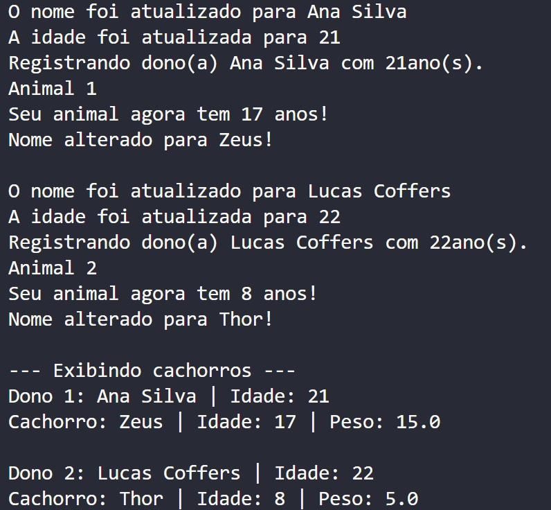
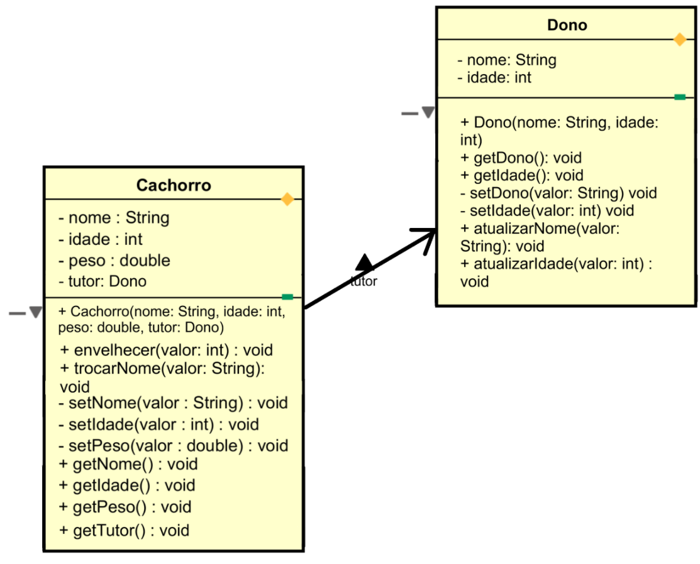

# Atividade da aula 5 de Java
Nome: Riquelme Santos da Mata  
Turma: CCPH2

## Documentação da atividade realizada na aula 5
A atividade é uma continuação da atividade 4, onde precisamos criar uma nova classe e fazer a comunicação entre dois objetos diferentes.

### Arquivo model
O repostirório model possui dois códigos, cada um com uma classe: Cachorro e Dono. Com a classe Dono, criamos um objeto que vai servir como atributo para a classe Cachorro. 

O atributo criado foio **tutor**, que vem da classe Dono. Ela representa o responsável pelo cachorro, e possui dois atributos: nome e idade. 
```
//Classe
public class Cachorro {
    
    // Atributos Simples
    private String nome;
    private int idade;
    private double peso;

    // Atributos de Associação
    private Dono tutor;
    
    public Cachorro(String nome, int idade, double peso, Dono tutor) {
    	this.setNome(nome);
    	this.setIdade(idade);
    	this.setPeso(peso);
        this.tutor = tutor;
    }
```
### Arquivo main
No arquivo main, é onde o código funciona. Dessa vez, criamos um objeto para a classe **Dono** e usamos esse objeto como atributo para a classe **Cachorro**.
```
// INSTANCIAÇÃO
// Criando primeiro dono
Dono ana = new Dono("Ana Silva", 21);
// Criando o primeiro cachorro (Objeto 1)
Cachorro cachorro1 = new Cachorro("Mike", 10, 15, ana);
System.out.println("Animal 1");
cachorro1.envelhecer(7);
cachorro1.trocarNome("Zeus");
System.out.println();
```
### Exibindo os resultados


### Diagrama - ASTAH

OBS: A licença de estudante expirou, então foi adaptado usei o diagrama das aulas anteriores e adaptei em outro programa.
### Pergunta de reflexão
Não é melhor usar apenas a String, porque ela guarda só o nome e não permite executar ações. A Viagem precisa do objeto Passageiro para acessar e modificar dados reais, como descontar o saldo ao final. Ou seja, o objeto completo é necessário não só pelos dados, mas pelo comportamento que ele oferece.
